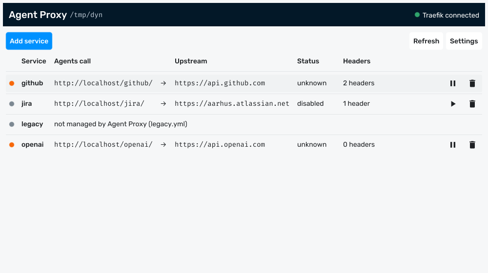
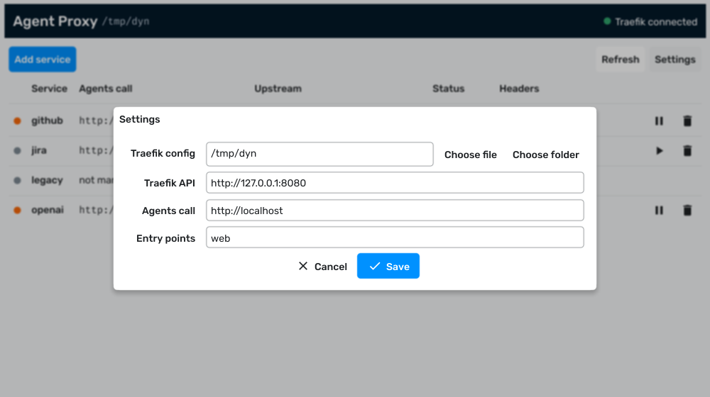
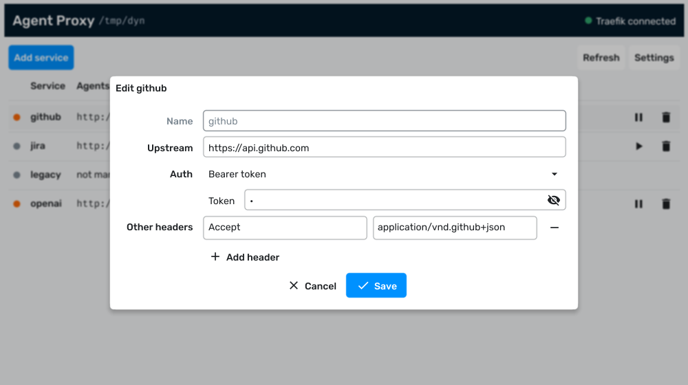

# Agent Proxy

A small desktop app that lets AI agents reach external APIs through a local
[Traefik](https://traefik.io/) instance. Each service you add becomes a path on
your Traefik host, for example `http://localhost/github/`, that forwards to the
upstream API with the auth headers injected on the way. Agents never see the
credentials; they only get the local URL.

Agent Proxy writes plain Traefik dynamic configuration (YAML) and reads route
status back from the Traefik API. There is no daemon and nothing to keep running
once you close the window.



## How it works

For a service named `github` with upstream `https://api.github.com`, Agent Proxy
writes one router, one service and two middlewares to Traefik's file provider:

```yaml
http:
  routers:
    github:
      rule: PathPrefix(`/github`)
      entryPoints: [web]
      middlewares: [github-strip, github-headers]
      service: github
  middlewares:
    github-strip:
      stripPrefix:
        prefixes: [/github]
    github-headers:
      headers:
        customRequestHeaders:
          Authorization: Bearer ghp_xxx
  services:
    github:
      loadBalancer:
        passHostHeader: false
        servers:
          - url: https://api.github.com
```

Traefik picks the file up on its own. A request to
`http://localhost/github/repos/x/y` is forwarded to
`https://api.github.com/repos/x/y` with the `Authorization` header added.

## Requirements

- Go 1.27 or newer
- A C compiler, since the GUI is built with [Fyne](https://fyne.io/)
- [Task](https://taskfile.dev/) is optional but used in the examples below
- Traefik with the file provider and the API enabled, see below

### Linux

Debian or Ubuntu need the X11, Wayland and OpenGL headers:

```sh
task deps
```

or directly:

```sh
sudo apt install -y gcc libgl1-mesa-dev libxxf86vm-dev libxcursor-dev \
  libxrandr-dev libxinerama-dev libxi-dev libxkbcommon-dev libwayland-dev
```

### macOS

```sh
xcode-select --install          # clang, or: task deps
brew install go go-task         # Go and Task
```

The fyne CLI used by `task package` is pinned in `tools/go.mod` and runs through
`go tool`, so there is nothing else to install. ImageMagick 7 is only needed for
`task icon`.

Builds must be done on a Mac. Cross compiling from Linux needs the macOS SDK,
which Apple's licence only allows on Apple hardware.

## Build

```sh
task build          # produces ./agent-proxy for this machine
task check          # gofmt, vet and tests
task run -- -config /path/to/traefik/dynamic
task package        # macOS only: "Agent Proxy.app" and agent-proxy-macos.zip
task run:app        # macOS only: package and open "Agent Proxy.app"
```

Without Task:

```sh
go build -o agent-proxy .
go test ./...
```

The binary is self contained. The fonts and the app icon are embedded, and
`FyneApp.toml` holds the bundle name, ID, and version used by `task package`.

### macOS app bundle

`task package` builds a universal binary (Apple Silicon and Intel), wraps it in
`Agent Proxy.app`, signs it ad hoc and zips it with `ditto`. It needs macOS 13
or newer, which is what Go 1.27 supports.

Each run increments `Build` in `FyneApp.toml`. Commit that change when you
release, and discard it after local test builds.

On macOS, Task builds pass `-Wl,-no_warn_duplicate_libraries` to the linker.
This hides a harmless warning about `-lobjc` being linked twice. Plain
`go build` still shows it.

### First launch on macOS

The app is signed ad hoc, not with an Apple Developer ID, so Gatekeeper blocks a
downloaded copy the first time. Open it once, then go to System Settings →
Privacy & Security and click Open Anyway. Or clear the quarantine flag:

```sh
xattr -d com.apple.quarantine "Agent Proxy.app"
```

Each rebuild has a new signature, so macOS asks again for access to protected
folders such as Documents or Desktop.

## Traefik setup

Traefik needs the file provider pointed at a directory or file that Agent Proxy
can write to, and the API enabled so route status can be shown. A minimal
`traefik.yml`:

```yaml
entryPoints:
  web:
    address: ":80"

api:
  insecure: true      # exposes the API on :8080, fine on a local machine

providers:
  file:
    directory: /etc/traefik/dynamic
    watch: true
```

When Traefik runs in Docker, including Docker Desktop on macOS, point Agent
Proxy at the host side of the bind mount, not the container path.

## Usage

```sh
./agent-proxy -config ~/traefik/dynamic
```

Flags are only needed the first time. They are saved to `settings.json` in the
user config directory, `~/.config/agent-proxy/` on Linux and
`~/Library/Application Support/agent-proxy/` on macOS, and can be changed later
in the Settings dialog. `Agent Proxy.app` started from Finder takes no flags
and asks for the config path on first launch.

| Flag           | Meaning                                                         | Default                 |
|----------------|-----------------------------------------------------------------|-------------------------|
| `-config`      | Dynamic config directory, dynamic config file, or `traefik.yml` | none, asked on first run|
| `-traefik`     | Traefik API base URL                                            | `http://127.0.0.1:8080` |
| `-base`        | URL agents use to reach Traefik, shown in the list              | `http://localhost`      |
| `-entrypoints` | Comma separated entry points for new routers, empty means all   | `web`                   |

`-config` accepts three things:

- a directory: one `name.yml` per service, which is the recommended mode
- a dynamic config file: all services in one file, other content is preserved
- Traefik's static `traefik.yml`: the file provider path is read from it



### Adding a service

Click **Add service**. The name becomes the path prefix, so `github` is served at
`http://localhost/github/`. Pick an auth type and fill in the secret, and add any
other headers the upstream needs.



Auth types:

- **No auth**
- **Bearer token** sends `Authorization: Bearer <token>`
- **Basic auth** sends `Authorization: Basic <base64 user:password>`
- **API key** sends the key in a header of your choice, `X-API-Key` by default

Only schemes that boil down to a fixed header value are offered. Traefik cannot
sign requests, so AWS Signature, Digest, OAuth 1.0 and similar are out of scope.

Secrets are stored in plain text in the Traefik YAML, as Traefik requires. Keep
the config directory private.

### The service list

- **Double-click** a row to edit it.
- **Pause** disables a service. Its router is removed from the YAML so Traefik
  stops routing it, while the upstream and headers stay saved. **Play** writes
  the router back.
- **Trash** deletes the service after confirmation.
- **Status** comes from the Traefik API: `enabled` means Traefik serves the
  route, `error` means Traefik rejected it, `unknown` means Traefik has not
  reported it yet or the API is unreachable, and `disabled` means you paused it.
- Rows marked **not managed by Agent Proxy** are routers Traefik has that were
  not written in this shape. They are listed so you can see what else is
  configured, but edit them by hand.

## Development

```
main.go        settings, YAML model, Traefik status and the Fyne GUI
main_test.go   round-trip tests for the YAML model and auth header mapping
assets/        embedded fonts and icon, Rubik and Fira Mono are under the OFL
FyneApp.toml   app bundle metadata for fyne package
tools/         separate Go module pinning the fyne CLI
docs/          README screenshots
Taskfile.yml   build, test, check, run, package, icon, deps, clean
```

Regenerate the icon after editing `assets/icon.svg` with `task icon`
(requires ImageMagick 7, `brew install imagemagick` on macOS).
